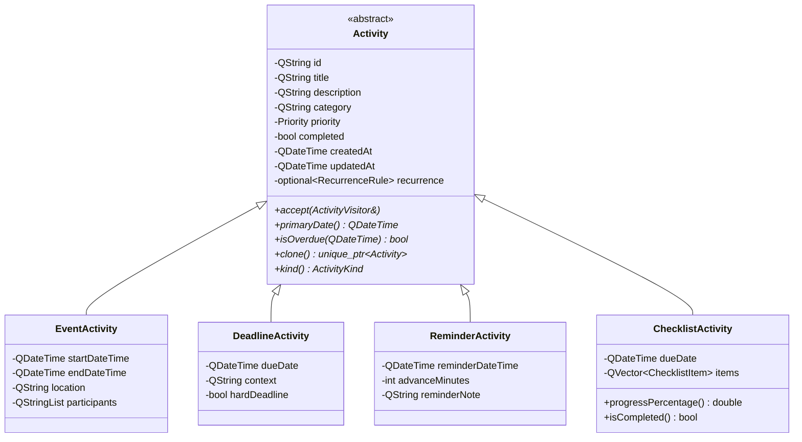
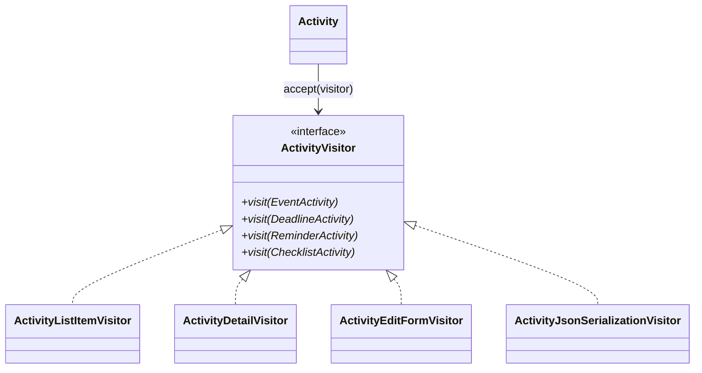
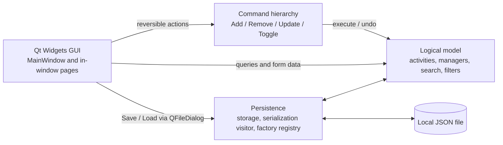
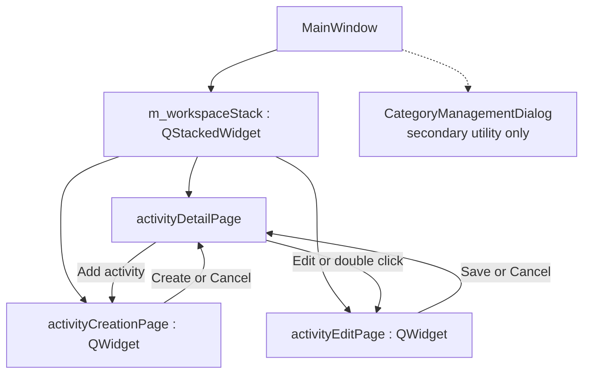
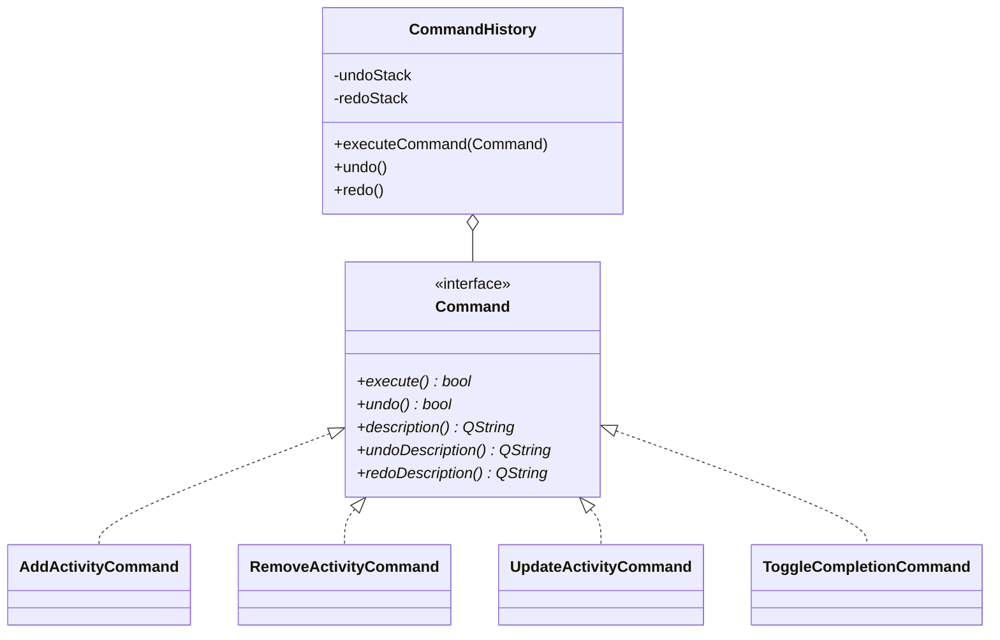

# UML and architecture diagrams

These diagrams describe the corrected architecture used by the final report. They intentionally separate the logical model from Qt Widgets and show the non-trivial dynamic behavior introduced for the resubmission.

## Activity hierarchy

`kind()` is a descriptive classifier. Existing-activity rendering, editing, and serialization are dispatched through `accept(...)`, not through a type switch.

## Visitor double dispatch

- `ActivityListItemVisitor` creates type-specific list cards.
- `ActivityDetailVisitor` creates different detail-page structures.
- `ActivityEditFormVisitor` populates, validates, and rebuilds each concrete edit form.
- `ActivityJsonSerializationVisitor` serializes different fields for each concrete type.

## Application layers

## In-window creation and editing

Creation and editing remain inside `MainWindow`. The remaining category dialog is a secondary management utility and is not part of the mandatory creation/editing workflow.

## Command hierarchy

